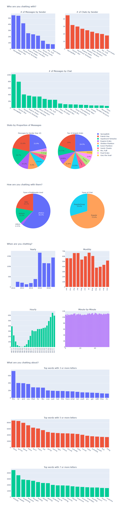
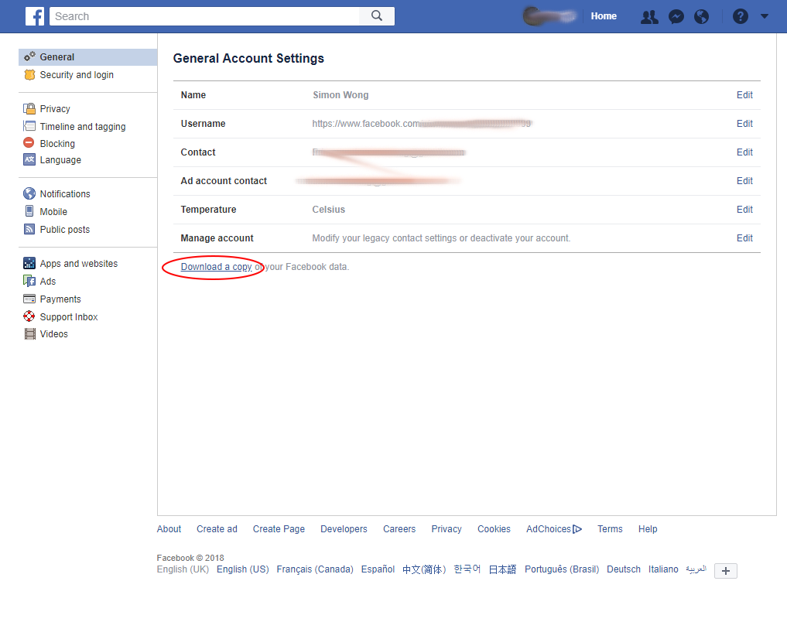
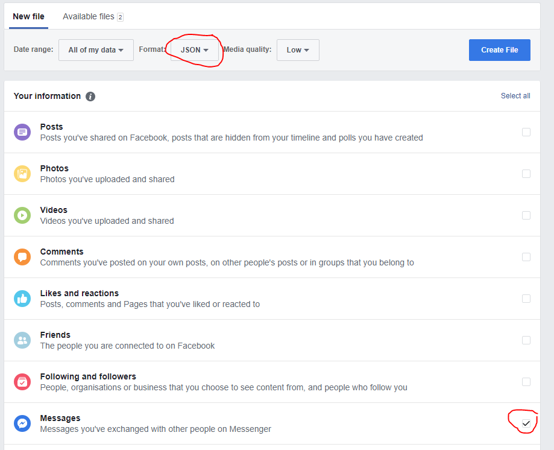
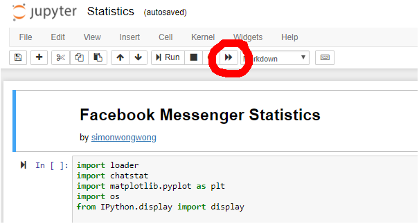

# Facebook-Messenger-Statistics
Discover fun stats about your Facebook Messenger usage such as: most used words, most active year, most active hours, etc.

For **instructions** [scroll down](#how-to-use)

Example report [here](report/facebook-messenger-stats.md)

# How to use

Download your Facebook Messenger data [in your setings page](https://www.facebook.com/settings)

Make sure to download in JSON format. Media quality can be set to low for a faster download

Drop the Python files and Jupyter notebook into the 'messages' folder and run [the extraction script](extract.py) to pull the JSON files from the individual folders

Then drop the rest of the Python files into the folder with the extracted JSON files

Open the Jupyter notebook and run the code to generate your report and interact with it:

