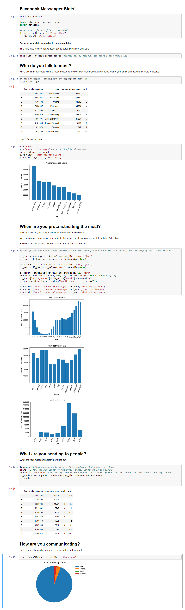

# Facebook-Messenger-Statistics
Discover fun stats about your Facebook Messenger usage such as: most used words, most active year, most active hours, etc.

Download your Facebook Messenger data [here](https://www.facebook.com/settings)

Drop the Python files and Jupyter notebook into the 'messages' folder 

Run the [extraction script](extract.py) to pull out all the HTML files

Open the Jupyter notebook and run the code to generate your report and interact with it:

