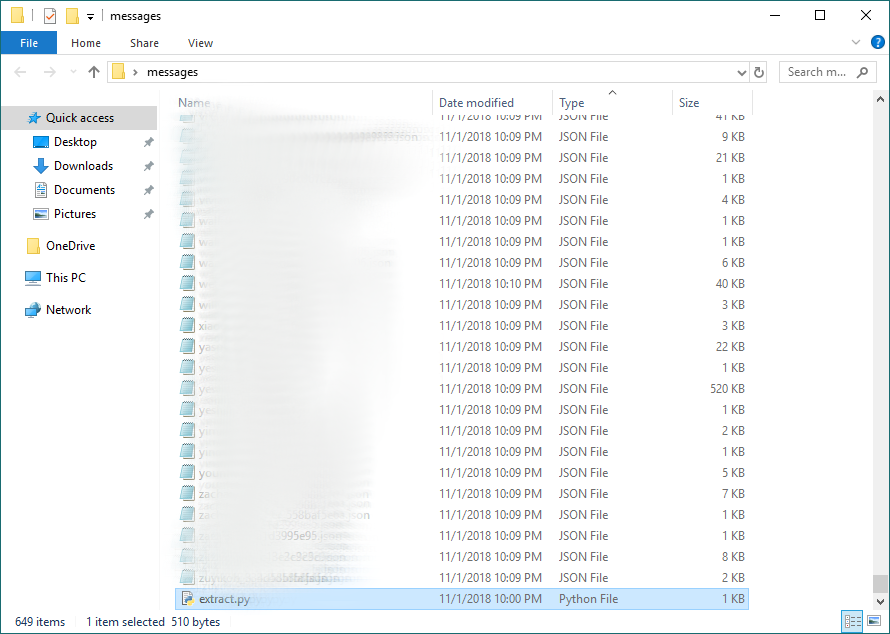
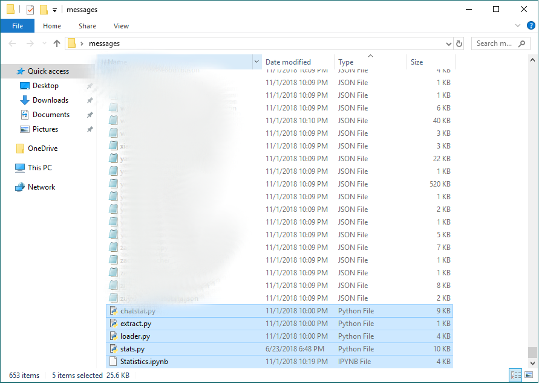
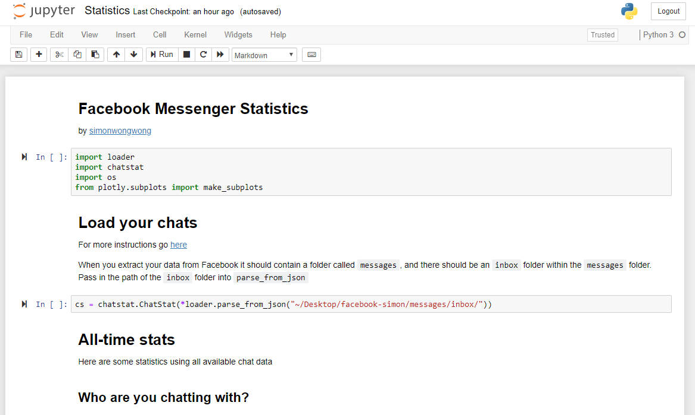

# Facebook-Messenger-Statistics
Discover fun stats about your Facebook Messenger usage such as: most used words, most active year, most active hours, etc.

For **instructions** [scroll down](#how-to-use)

# Example Report


# How to use

Download your Facebook Messenger data [in your setings page](https://www.facebook.com/settings)


Make sure to download in JSON format. Media quality can be set to low for a faster download

## Python and Python libraries

1. If you don't have Python, install Python 3.7+
2. Open a console on the project directory and run:
```
pip install -r "requirements.txt"
```

Copy [the extraction script](extract.py) into the "{extract_location}/messages/inbox" folder from the Facebook download (this folder should contain folders with chat names and JSON files within those folders). Script could also be dropped in "{extract_location}/messages/archived_threads" or any of the other folders within "/messages". JSON files should be placed all in one directory if they are to be included in the analysis.


Run the extract script to pull the JSON files from the individual folders into one directory



Copy the rest of the files in the project folder (python files and Jupyter notebook) into the same folder with all of the JSON files.



Open a console in the folder and start Jupyter Notebook using `jupyter notebook` command.
From the Notebook file tree, open the Statistics notebook `Statistics.ipynb`




Run the code to generate your report and interact with it:


