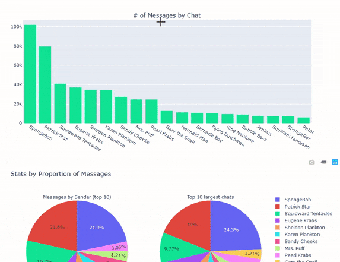
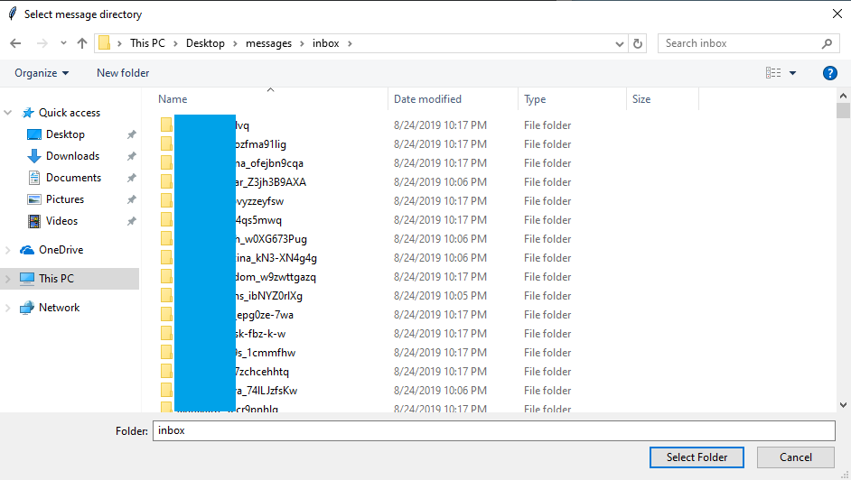

# Facebook Messenger Statistics
Have you downloaded your Facebook data? Are you curious/concerned about your Messenger usage?
Discover fun stats about your Facebook Messenger usage such as: most used words, most active year, most active hours, etc.

Plots can be created using a Jupyter Notebook for exploratory analysis or a basic HTML report can be generated using the `generate_report.py` script.



For **instructions** [scroll down](#how-to-use)

# Example Report


# How to use
## Download your Messenger data from Facebook
Download your Facebook Messenger data [in your settings page](https://www.facebook.com/settings)


Make sure to download in JSON format. Media quality can be set to low for a faster download

## Clone this repository
Clone this repo using:
```
git clone git@github.com:simonwongwong/Facebook-Messenger-Statistics.git
```
And open the folder/navigate to the directory
## Install Python and Python libraries

1. If you don't have Python, install Python 3.7+
2. Open a console on the project directory (or create your own custom environment) and run:
```
pip install -r "requirements.txt"
```

## Generate an HTML report
Run the `generate_report.py` script either using your terminal or double-click the file on Windows

Locate your `inbox` folder from your extracted Facebook data using the file dialog. This folder should contain more folders for each chat and each of those folders should contain a `message_1.json` file.


If it runs successfully, you should receive a message similar to:
```
Parsing data from C:/Users/Simon/Desktop/messages/inbox
Report generated successfully!
```
And an HTML report should be at your current working directory.

## Exploratory analysis on Jupyter
Open a console in the folder and start Jupyter Notebook using `jupyter notebook` command.
From the Notebook file tree, open the Statistics notebook `Statistics.ipynb`


Make sure the correct directory is passed into `loader.parse_from_json()` and then have fun!

See `chatstat.py` or docstrings for parameters you can play with in the plot generators. 
