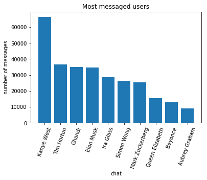
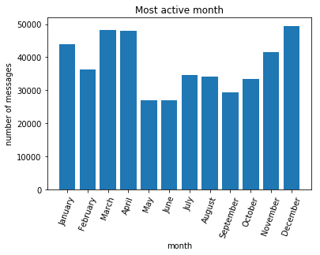
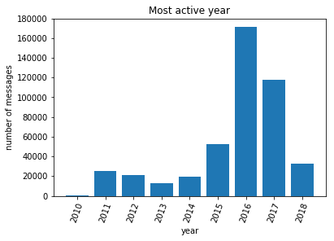
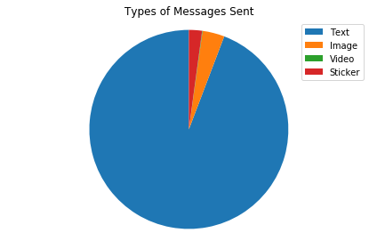

# Facebook Messenger Stats!


```python
%matplotlib inline

import stats, message_parser, os
import datetime

#create path for csv files to be saved
if not os.path.exists('.\\csv files'):
	os.mkdir('.\\csv files\\')
```

**Parse all your data into a dict to be manipulated**

This may take a while! Takes about 30s to parse 500 MB of chat data


```python
chat_dict = message_parser.parse() #parses all by default. can parse single html files
```

# Who do you talk to most?

First, let's find your chats with the most messages!
getMostMessaged takes 2 arguments: dict of your chats and how many chats to display


```python
df_most_messaged = stats.getMostMessaged(chat_dict, 10)
df_most_messaged
```


<div>
<style scoped>
    .dataframe tbody tr th:only-of-type {
        vertical-align: middle;
    }

    .dataframe tbody tr th {
        vertical-align: top;
    }

    .dataframe thead th {
        text-align: right;
    }
</style>
<table border="1" class="dataframe">
  <thead>
    <tr style="text-align: right;">
      <th></th>
      <th>% of total messages</th>
      <th>chat</th>
      <th>number of messages</th>
      <th>rank</th>
    </tr>
  </thead>
  <tbody>
    <tr>
      <th>0</th>
      <td>14.651932</td>
      <td>Kanye West</td>
      <td>66386</td>
      <td>1</td>
    </tr>
    <tr>
      <th>1</th>
      <td>8.084981</td>
      <td>Tim Horton</td>
      <td>36632</td>
      <td>2</td>
    </tr>
    <tr>
      <th>2</th>
      <td>7.705584</td>
      <td>Ghandi</td>
      <td>34913</td>
      <td>3</td>
    </tr>
    <tr>
      <th>3</th>
      <td>7.628557</td>
      <td>Elon Musk</td>
      <td>34564</td>
      <td>4</td>
    </tr>
    <tr>
      <th>4</th>
      <td>6.329469</td>
      <td>Ira Glass</td>
      <td>28678</td>
      <td>5</td>
    </tr>
    <tr>
      <th>5</th>
      <td>5.805949</td>
      <td>Simon Wong</td>
      <td>26306</td>
      <td>6</td>
    </tr>
    <tr>
      <th>6</th>
      <td>5.567805</td>
      <td>Mark Zuckerberg</td>
      <td>25227</td>
      <td>7</td>
    </tr>
    <tr>
      <th>7</th>
      <td>3.421859</td>
      <td>Queen Elizabeth</td>
      <td>15504</td>
      <td>8</td>
    </tr>
    <tr>
      <th>8</th>
      <td>2.835879</td>
      <td>Beyonce</td>
      <td>12849</td>
      <td>9</td>
    </tr>
    <tr>
      <th>9</th>
      <td>1.984166</td>
      <td>Aubrey Graham</td>
      <td>8990</td>
      <td>10</td>
    </tr>
  </tbody>
</table>
</div>


Now let's plot this data:


```python
x = 'chat'
y = 'number of messages' #or plot '% of total messages'
data = df_most_messaged
plot_title = 'Most messaged users'
stats.plot(x,y, data, plot_title)
```





# When are you procrastinating the most?

Now let's look at your most active times on Facebook Messenger: 

We can compare most active time, minute, hour, day, month, or year using stats.getMostActiveTime

However, the most active minute, day and time are usually boring.


```python
#stats.getMostActiveTime takes arguments chat dictionary, number of items to display ('max' to display all), type of time

df_hour = stats.getMostActiveTime(chat_dict, 'max', "hour")
df_hour = df_hour.sort_values('hour', ascending=True)

df_year = stats.getMostActiveTime(chat_dict,'max', "year")
df_year = df_year.sort_values('year', ascending=True)

df_month = stats.getMostActiveTime(chat_dict, 12, "month")
months = {datetime.datetime(2000,i,1).strftime("%B"): i for i in range(1, 13)}
df_month["month_number"] = df_month["month"].map(months)
df_month = df_month.sort_values('month_number', ascending=True)

stats.plot('hour','number of messages', df_hour, 'Most active hour')
stats.plot('month','number of messages', df_month, 'Most active month')
stats.plot('year','number of messages', df_year, 'Most active year')
```








# What are you sending to people?

What are your most sent words? Let's find out:


```python
topNum = 10 #how many words to display (i.e. topNum = 10 displays top 10 words)
chars = 2 #the minimum length of the words, single letter words are boring!
sender = 'Simon Wong' #can use any name to find the most used words from a certain sender. or 'ANY_SENDER' for any sender
df_words = stats.getMostUsedWords(chat_dict, topNum, sender, chars)
df_words


```


<div>
<style scoped>
    .dataframe tbody tr th:only-of-type {
        vertical-align: middle;
    }

    .dataframe tbody tr th {
        vertical-align: top;
    }

    .dataframe thead th {
        text-align: right;
    }
</style>
<table border="1" class="dataframe">
  <thead>
    <tr style="text-align: right;">
      <th></th>
      <th>% of total messages</th>
      <th>number of uses</th>
      <th>rank</th>
      <th>word</th>
    </tr>
  </thead>
  <tbody>
    <tr>
      <th>0</th>
      <td>8.052858</td>
      <td>14016</td>
      <td>1</td>
      <td>the</td>
    </tr>
    <tr>
      <th>1</th>
      <td>7.365700</td>
      <td>12820</td>
      <td>2</td>
      <td>to</td>
    </tr>
    <tr>
      <th>2</th>
      <td>6.538926</td>
      <td>11381</td>
      <td>3</td>
      <td>lol</td>
    </tr>
    <tr>
      <th>3</th>
      <td>5.312841</td>
      <td>9247</td>
      <td>4</td>
      <td>it</td>
    </tr>
    <tr>
      <th>4</th>
      <td>5.190463</td>
      <td>9034</td>
      <td>5</td>
      <td>you</td>
    </tr>
    <tr>
      <th>5</th>
      <td>4.463660</td>
      <td>7769</td>
      <td>6</td>
      <td>and</td>
    </tr>
    <tr>
      <th>6</th>
      <td>4.386670</td>
      <td>7635</td>
      <td>7</td>
      <td>is</td>
    </tr>
    <tr>
      <th>7</th>
      <td>3.567940</td>
      <td>6210</td>
      <td>8</td>
      <td>for</td>
    </tr>
    <tr>
      <th>8</th>
      <td>3.386383</td>
      <td>5894</td>
      <td>9</td>
      <td>that</td>
    </tr>
    <tr>
      <th>9</th>
      <td>3.259983</td>
      <td>5674</td>
      <td>10</td>
      <td>like</td>
    </tr>
  </tbody>
</table>
</div>


# How are you communicating?

See your breakdown between text, image, video and stickers!


```python
stats.typesOfMessages(chat_dict, 'Simon Wong')
```




