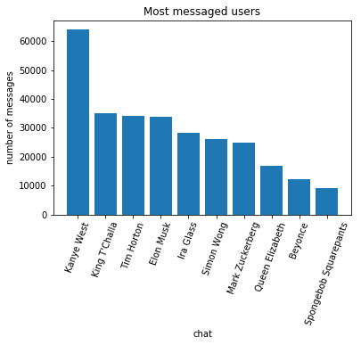
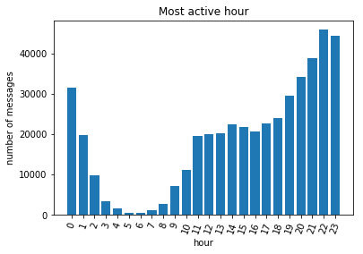
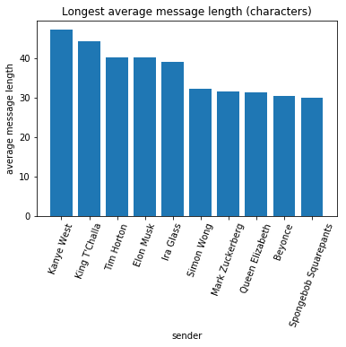
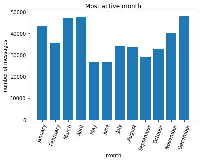
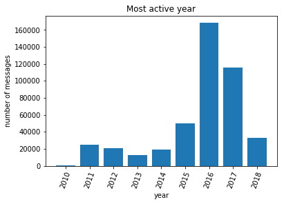
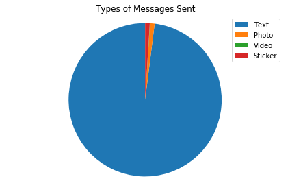
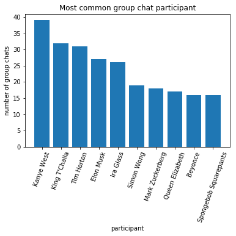

# Facebook Messenger Stats!


```python
%matplotlib inline

import JSON_message_parser, os, stats
import datetime

#create path for csv files to be saved
if not os.path.exists('.\\csv files'):
	os.mkdir('.\\csv files\\')
```

**Parse all your data into a dict to be manipulated**

This may take a while!


```python
chat_dict, totals = JSON_message_parser.parse() #parses all by default. can parse single html files
stats.setTotals(totals)
```

# Who do you talk to most?

First, let's find your chats with the most messages!
getMostMessaged takes 2 arguments: dict of your chats and how many chats to display


```python
df_most_messaged = stats.getMostMessaged(chat_dict, 10)
df_most_messaged
```


<div>
<style scoped>
    .dataframe tbody tr th:only-of-type {
        vertical-align: middle;
    }

    .dataframe tbody tr th {
        vertical-align: top;
    }

    .dataframe thead th {
        text-align: right;
    }
</style>
<table border="1" class="dataframe">
  <thead>
    <tr style="text-align: right;">
      <th></th>
      <th>% of total messages</th>
      <th>chat</th>
      <th>number of messages</th>
      <th>rank</th>
    </tr>
  </thead>
  <tbody>
    <tr>
      <th>0</th>
      <td>13.871468</td>
      <td>Kanye West</td>
      <td>63944</td>
      <td>1</td>
    </tr>
    <tr>
      <th>1</th>
      <td>7.629698</td>
      <td>King T'Challa</td>
      <td>35171</td>
      <td>2</td>
    </tr>
    <tr>
      <th>2</th>
      <td>7.429470</td>
      <td>Tim Horton</td>
      <td>34248</td>
      <td>3</td>
    </tr>
    <tr>
      <th>3</th>
      <td>7.342698</td>
      <td>Elon Musk</td>
      <td>33848</td>
      <td>4</td>
    </tr>
    <tr>
      <th>4</th>
      <td>6.109876</td>
      <td>Ira Glass</td>
      <td>28165</td>
      <td>5</td>
    </tr>
    <tr>
      <th>5</th>
      <td>5.626986</td>
      <td>Simon Wong</td>
      <td>25939</td>
      <td>6</td>
    </tr>
    <tr>
      <th>6</th>
      <td>5.398991</td>
      <td>Mark Zuckerberg</td>
      <td>24888</td>
      <td>7</td>
    </tr>
    <tr>
      <th>7</th>
      <td>3.659634</td>
      <td>Queen Elizabeth</td>
      <td>16870</td>
      <td>8</td>
    </tr>
    <tr>
      <th>8</th>
      <td>2.632247</td>
      <td>Beyonce</td>
      <td>12134</td>
      <td>9</td>
    </tr>
    <tr>
      <th>9</th>
      <td>1.948045</td>
      <td>Spongebob Squarepants</td>
      <td>8980</td>
      <td>10</td>
    </tr>
  </tbody>
</table>
</div>


Now let's plot this data:


```python
x = 'chat'
y = 'number of messages' #or plot '% of total messages'
data = df_most_messaged
plot_title = 'Most messaged users'
stats.plot(x,y, data, plot_title)
```





Of the people you talk to most, who sends the longest messages?

Let's see who sends the most **words** per message:


```python
most_active_chats = df_most_messaged['chat']

df_lengthiest_sender = stats.getAverageMessageLength(chat_dict, len(most_active_chats), most_active_chats, typeLen='words')

stats.plot('sender', 'average message length', df_lengthiest_sender, 'Average message length (words)')
df_lengthiest_sender

```





<div>
<style scoped>
    .dataframe tbody tr th:only-of-type {
        vertical-align: middle;
    }

    .dataframe tbody tr th {
        vertical-align: top;
    }

    .dataframe thead th {
        text-align: right;
    }
</style>
<table border="1" class="dataframe">
  <thead>
    <tr style="text-align: right;">
      <th></th>
      <th>average message length</th>
      <th>rank</th>
      <th>sender</th>
    </tr>
  </thead>
  <tbody>
    <tr>
      <th>0</th>
      <td>9.652344</td>
      <td>1</td>
      <td>Kanye West</td>
    </tr>
    <tr>
      <th>1</th>
      <td>8.686833</td>
      <td>2</td>
      <td>King T'Challa</td>
    </tr>
    <tr>
      <th>2</th>
      <td>7.800000</td>
      <td>3</td>
      <td>Tim Horton</td>
    </tr>
    <tr>
      <th>3</th>
      <td>7.545455</td>
      <td>4</td>
      <td>Elon Musk</td>
    </tr>
    <tr>
      <th>4</th>
      <td>7.476190</td>
      <td>5</td>
      <td>Ira Glass</td>
    </tr>
    <tr>
      <th>5</th>
      <td>6.564205</td>
      <td>6</td>
      <td>Simon Wong</td>
    </tr>
    <tr>
      <th>6</th>
      <td>6.201754</td>
      <td>7</td>
      <td>Mark Zuckerberg</td>
    </tr>
    <tr>
      <th>7</th>
      <td>6.117181</td>
      <td>8</td>
      <td>Queen Elizabeth</td>
    </tr>
    <tr>
      <th>8</th>
      <td>6.029116</td>
      <td>9</td>
      <td>Beyonce</td>
    </tr>
    <tr>
      <th>9</th>
      <td>5.991622</td>
      <td>10</td>
      <td>Spongebob Squarepants</td>
    </tr>
  </tbody>
</table>
</div>


What about most **characters** per message?


```python
df_lengthiest_sender = stats.getAverageMessageLength(chat_dict, len(most_active_chats), most_active_chats, typeLen='chars')

stats.plot('sender', 'average message length', df_lengthiest_sender, 'Longest average message length (characters)')
df_lengthiest_sender
```





<div>
<style scoped>
    .dataframe tbody tr th:only-of-type {
        vertical-align: middle;
    }

    .dataframe tbody tr th {
        vertical-align: top;
    }

    .dataframe thead th {
        text-align: right;
    }
</style>
<table border="1" class="dataframe">
  <thead>
    <tr style="text-align: right;">
      <th></th>
      <th>average message length</th>
      <th>rank</th>
      <th>sender</th>
    </tr>
  </thead>
  <tbody>
    <tr>
      <th>0</th>
      <td>47.269531</td>
      <td>1</td>
      <td>Kanye West</td>
    </tr>
    <tr>
      <th>1</th>
      <td>44.348754</td>
      <td>2</td>
      <td>King T'Challa</td>
    </tr>
    <tr>
      <th>2</th>
      <td>40.400000</td>
      <td>3</td>
      <td>Tim Horton</td>
    </tr>
    <tr>
      <th>3</th>
      <td>40.181818</td>
      <td>4</td>
      <td>Elon Musk</td>
    </tr>
    <tr>
      <th>4</th>
      <td>39.095238</td>
      <td>5</td>
      <td>Ira Glass</td>
    </tr>
    <tr>
      <th>5</th>
      <td>32.337969</td>
      <td>6</td>
      <td>Simon Wong</td>
    </tr>
    <tr>
      <th>6</th>
      <td>31.701754</td>
      <td>7</td>
      <td>Mark Zuckerberg</td>
    </tr>
    <tr>
      <th>7</th>
      <td>31.373253</td>
      <td>8</td>
      <td>Queen Elizabeth</td>
    </tr>
    <tr>
      <th>8</th>
      <td>30.469779</td>
      <td>9</td>
      <td>Beyonce</td>
    </tr>
    <tr>
      <th>9</th>
      <td>30.091365</td>
      <td>10</td>
      <td>Spongebob Squarepants</td>
    </tr>
  </tbody>
</table>
</div>


# When are you procrastinating the most?

Now let's look at your most active times on Facebook Messenger: 

We can compare most active time, minute, hour, day, month, or year using stats.getMostActiveTime

However, the most active minute, day and time are usually boring and uniform.


```python
#stats.getMostActiveTime takes arguments chat dictionary, number of items to display ('max' to display all), type of time

df_hour = stats.getMostActiveTime(chat_dict, 'max', "hour")
df_hour = df_hour.sort_values('hour', ascending=True)

df_year = stats.getMostActiveTime(chat_dict,'max', "year")
df_year = df_year.sort_values('year', ascending=True)

df_month = stats.getMostActiveTime(chat_dict, 12, "month")
months = {datetime.datetime(2000,i,1).strftime("%B"): i for i in range(1, 13)}
df_month["month_number"] = df_month["month"].map(months)
df_month = df_month.sort_values('month_number', ascending=True)

stats.plot('hour','number of messages', df_hour, 'Most active hour')
stats.plot('month','number of messages', df_month, 'Most active month')
stats.plot('year','number of messages', df_year, 'Most active year')
```








# What are you sending to people?

What are your most sent words? Let's find out:


```python
topNum = 10 #how many words to display (i.e. topNum = 10 displays top 10 words)
chars = 4 #the minimum length of the words, single letter words are boring!
sender = 'Simon Wong' #can use any name to find the most used words from a certain sender. or 'ANY_SENDER' for any sender
df_words = stats.getMostUsedWords(chat_dict, topNum, sender, chars)
df_words


```


<div>
<style scoped>
    .dataframe tbody tr th:only-of-type {
        vertical-align: middle;
    }

    .dataframe tbody tr th {
        vertical-align: top;
    }

    .dataframe thead th {
        text-align: right;
    }
</style>
<table border="1" class="dataframe">
  <thead>
    <tr style="text-align: right;">
      <th></th>
      <th>% of total messages</th>
      <th>number of uses</th>
      <th>rank</th>
      <th>word</th>
    </tr>
  </thead>
  <tbody>
    <tr>
      <th>0</th>
      <td>1.284451</td>
      <td>5921</td>
      <td>1</td>
      <td>that</td>
    </tr>
    <tr>
      <th>1</th>
      <td>1.241282</td>
      <td>5722</td>
      <td>2</td>
      <td>like</td>
    </tr>
    <tr>
      <th>2</th>
      <td>1.071859</td>
      <td>4941</td>
      <td>3</td>
      <td>yeah</td>
    </tr>
    <tr>
      <th>3</th>
      <td>0.964261</td>
      <td>4445</td>
      <td>4</td>
      <td>what</td>
    </tr>
    <tr>
      <th>4</th>
      <td>0.870763</td>
      <td>4014</td>
      <td>5</td>
      <td>have</td>
    </tr>
    <tr>
      <th>5</th>
      <td>0.853192</td>
      <td>3933</td>
      <td>6</td>
      <td>this</td>
    </tr>
    <tr>
      <th>6</th>
      <td>0.827160</td>
      <td>3813</td>
      <td>7</td>
      <td>just</td>
    </tr>
    <tr>
      <th>7</th>
      <td>0.811758</td>
      <td>3742</td>
      <td>8</td>
      <td>lmao</td>
    </tr>
    <tr>
      <th>8</th>
      <td>0.706763</td>
      <td>3258</td>
      <td>9</td>
      <td>with</td>
    </tr>
    <tr>
      <th>9</th>
      <td>0.614133</td>
      <td>2831</td>
      <td>10</td>
      <td>they</td>
    </tr>
  </tbody>
</table>
</div>


# How are you communicating?

See your breakdown between text, image, video and stickers!


```python
df_type = stats.typesOfMessages(chat_dict, 'Dilip Rathinakumar')
df_type
```





<div>
<style scoped>
    .dataframe tbody tr th:only-of-type {
        vertical-align: middle;
    }

    .dataframe tbody tr th {
        vertical-align: top;
    }

    .dataframe thead th {
        text-align: right;
    }
</style>
<table border="1" class="dataframe">
  <thead>
    <tr style="text-align: right;">
      <th></th>
      <th>% of total messages</th>
      <th>number of messages</th>
      <th>type of message</th>
    </tr>
  </thead>
  <tbody>
    <tr>
      <th>0</th>
      <td>0.969288</td>
      <td>273</td>
      <td>stickers</td>
    </tr>
    <tr>
      <th>1</th>
      <td>0.976389</td>
      <td>275</td>
      <td>photos</td>
    </tr>
    <tr>
      <th>2</th>
      <td>0.046157</td>
      <td>13</td>
      <td>videos</td>
    </tr>
    <tr>
      <th>3</th>
      <td>98.008166</td>
      <td>27604</td>
      <td>text</td>
    </tr>
  </tbody>
</table>
</div>


```python
df_most_common = stats.inMostGroupChats(chat_dict, 10)
df_most_common
```


<div>
<style scoped>
    .dataframe tbody tr th:only-of-type {
        vertical-align: middle;
    }

    .dataframe tbody tr th {
        vertical-align: top;
    }

    .dataframe thead th {
        text-align: right;
    }
</style>
<table border="1" class="dataframe">
  <thead>
    <tr style="text-align: right;">
      <th></th>
      <th>% of total chats</th>
      <th>number of group chats</th>
      <th>participant</th>
      <th>rank</th>
    </tr>
  </thead>
  <tbody>
    <tr>
      <th>0</th>
      <td>7.129799</td>
      <td>39</td>
      <td>Kanye West</td>
      <td>1</td>
    </tr>
    <tr>
      <th>1</th>
      <td>5.850091</td>
      <td>32</td>
      <td>King T'Challa</td>
      <td>2</td>
    </tr>
    <tr>
      <th>2</th>
      <td>5.667276</td>
      <td>31</td>
      <td>Tim Horton</td>
      <td>3</td>
    </tr>
    <tr>
      <th>3</th>
      <td>4.936015</td>
      <td>27</td>
      <td>Elon Musk</td>
      <td>4</td>
    </tr>
    <tr>
      <th>4</th>
      <td>4.753199</td>
      <td>26</td>
      <td>Ira Glass</td>
      <td>5</td>
    </tr>
    <tr>
      <th>5</th>
      <td>3.473492</td>
      <td>19</td>
      <td>Simon Wong</td>
      <td>6</td>
    </tr>
    <tr>
      <th>6</th>
      <td>3.290676</td>
      <td>18</td>
      <td>Mark Zuckerberg</td>
      <td>7</td>
    </tr>
    <tr>
      <th>7</th>
      <td>3.107861</td>
      <td>17</td>
      <td>Queen Elizabeth</td>
      <td>8</td>
    </tr>
    <tr>
      <th>8</th>
      <td>2.925046</td>
      <td>16</td>
      <td>Beyonce</td>
      <td>9</td>
    </tr>
    <tr>
      <th>9</th>
      <td>2.925046</td>
      <td>16</td>
      <td>Spongebob Squarepants</td>
      <td>10</td>
    </tr>
  </tbody>
</table>
</div>


```python
stats.plot('participant','number of group chats', df_most_common, 'Most common group chat participant')
```




